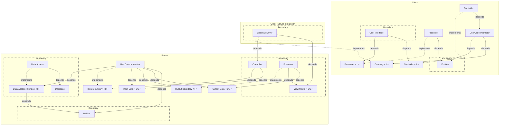

# Frontend and Backend Clean Reactive Architecture

The frontend uses Clean Reactive Architecture and reaches the backend through
its gateway. The backend follows the conventional Clean Architecture
controller/use-case/presenter arrangement.

  
mermaid

