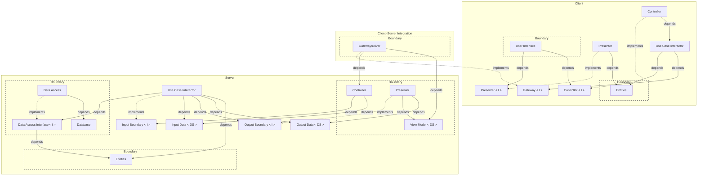
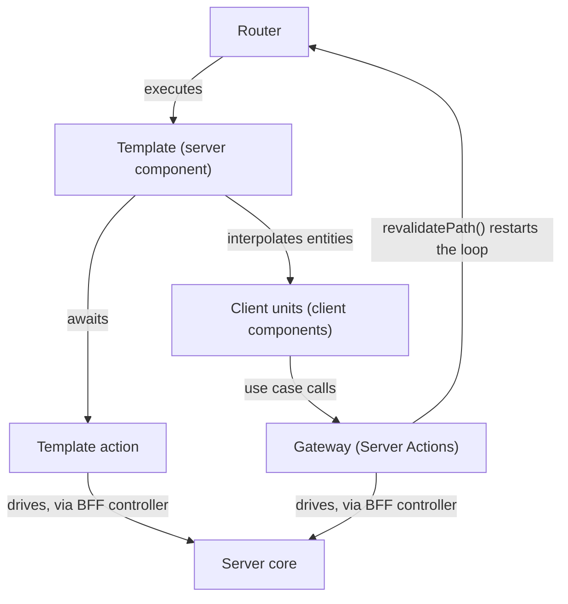

# Clean Reactive Architecture — React + Next.js Sample

A full-stack React + Next.js sample application built on the
[Clean Architecture](https://blog.cleancoder.com/uncle-bob/2012/08/13/the-clean-architecture.html)
concept, which covers both the client and the server parts:

- The **client** is a reactive application and follows
  [Clean Reactive Architecture](https://github.com/clean-reactive/documentation/blob/main/docs/architecture.md)
  — the concept's implementation tailored for reactive applications.
- The **server** is the core the client connects to and follows the
  request-response Clean Architecture implementation, where control flows
  through once per invocation and terminates.

The sample shows a concrete, working mapping of every architectural unit from
both diagrams to idiomatic Next.js code — with unit, integration, and end-to-end
tests for each level of composition.


<details>
  <summary>mermaid</summary>



</details>

1. Explain Gateway/Driver role in details
2. Add diagram for the public API (driver->request-response CA diagram)

Ref to source commit <bdfaf312ed47ce8dce6647009eabcb2f1b6150d3>

## Getting started

Install dependencies:

```sh
npm ci
```

Start the development server with the in-file backend (JSON files, no database
required):

```sh
npm run dev
```

Or with the SQLite backend (Drizzle + libSQL, local database file):

```sh
npm run db:push       # create the schema on first run
npm run dev:sqlite
```

Default environment values live in `.env`; create a git-ignored `.env.local` to
override them. The `PERSISTENCE` variable selects which backend the DI container
wires up.

Run the tests:

```sh
npm test              # static checks (format, types, lint) + unit tests
npm run test:e2e      # build + Playwright e2e against both backends
npm run test:full     # everything
```

## Tech stack

- [Next.js](https://nextjs.org/) 14 (App Router, Server Actions)
- [React](https://react.dev/) 18
- [TypeScript](https://www.typescriptlang.org/)
- [Zod](https://zod.dev/) for entity models and input validation
- [Drizzle ORM](https://orm.drizzle.team/) +
  [libSQL](https://github.com/tursodatabase/libsql) (SQLite)
- [Lucia](https://lucia-auth.com/) for session-based authentication
- [@evyweb/ioctopus](https://github.com/Evyweb/ioctopus) as the DI container
- [Tailwind CSS](https://tailwindcss.com/) + [shadcn/ui](https://ui.shadcn.com/)
  (Radix UI)
- [Vitest](https://vitest.dev/) for unit and integration tests
- [Playwright](https://playwright.dev/) for end-to-end tests
- [eslint-plugin-boundaries](https://github.com/javierbrea/eslint-plugin-boundaries)
  for architecture boundary enforcement

## Architecture mapping

### Client (Clean Reactive Architecture)

| Architectural unit          | React / Next.js equivalent           | Location                                                                                                         |
| --------------------------- | ------------------------------------ | ---------------------------------------------------------------------------------------------------------------- |
| Enterprise business entity  | Plain data type, server-provided     | `TodoEntity` in `app/(home)/page.types.ts`                                                                       |
| Application business entity | `useReducer` state machine + context | `app/(home)/reducer.ts` + `context.tsx`, `app/(auth)/*/reducer.ts`                                               |
| Gateway interface           | TypeScript interface                 | `HomePageGateway` in `app/(home)/gateway/gateway.types.ts`, `app/(auth)/*/gateway/gateway.types.ts`              |
| Gateway implementation      | Server Actions bundle                | `app/(home)/gateway/gateway.ts` + `gateway/actions/*.action.ts`                                                  |
| Use case interactor         | React hook                           | `app/(auth)/sign-up/hooks/use-sign-up-use-case.ts`                                                               |
| Presenter                   | React hook returning a view model    | `app/(home)/todos/use-presenter.ts`, `todo-item/use-presenter.ts`, `app/(auth)/sign-up/hooks/use-presenter.ts`   |
| Controller                  | React hook returning callbacks       | `app/(home)/todos/use-controller.ts`, `add-todo/use-controller.ts`, `app/(auth)/sign-up/hooks/use-controller.ts` |
| User interface              | React client components              | `app/(home)/todos/todos.tsx`, `todos/todo-item/todo-item.tsx`, `app/(auth)/sign-in/page.tsx`                     |

### Server (request-response Clean Architecture)

| Architectural unit                  | Location                                                                                                                                                              |
| ----------------------------------- | --------------------------------------------------------------------------------------------------------------------------------------------------------------------- |
| Entities                            | `src/entities/models` (Zod schemas + factories), `src/entities/errors`                                                                                                |
| Input boundary / Input, Output data | `contract.ts` next to each controller and presenter (`src/interface-adapters/**/contract.ts`)                                                                         |
| Use case interactor                 | `src/application/use-cases/{auth,todos}`                                                                                                                              |
| Data access interface               | `src/application/repositories/*.interface.ts`, `src/application/services/*.interface.ts`                                                                              |
| Data access                         | `src/infrastructure/repositories`, `src/infrastructure/services` (`.sqlite` / `.in-file` / `.mock` variants)                                                          |
| Controller / Presenter / View model | `src/interface-adapters/{api,bff,e2e}/**/{controller,presenter}.ts`                                                                                                   |
| Database                            | `drizzle/` (schema + migrations) or JSON files (in-file backend)                                                                                                      |
| Frameworks & drivers                | `app/api/**/route.ts` (REST), `app/**/gateway/actions` (Server Actions), `app/(home)/page.tsx` + `page.action.ts` (template + page action), `tests/e2e/e2e-driver.ts` |

## React server component mental model

The classic server-rendering flow is
`router → handler (controller) → passive template`: the router calls a handler —
a controller that drives the server core — and the handler prepares the data and
interpolates it into a passive template. Next.js swaps the last two steps —
`router → executable template → handler (controller)`: the router runs an
executable template (`(home)/page.tsx`) along with its **template action**
(`(home)/page.action.ts`); the action calls the handler — concretely a BFF
controller driving the server core — and the executed template ends up with its
data interpolated.

All of this machinery — the router, the template, and its page action — is a
**frameworks & drivers concern**: Next.js machinery that drives the server core
and delivers its output to the client, and none of it is a unit of the client's
Clean Reactive Architecture. The client core (entities, presenters, controllers,
gateway) begins below the template, in the client components it renders.

Interpolation is also how enterprise data reaches the client — and why the
client's enterprise business entity carries no rules. `TodoEntity` values enter
the client only as interpolated template data, and the client never mutates
them: every change goes pessimistically through the gateway, the server core
applies the enterprise business rules, and the Server Action ends with
`revalidatePath()` — re-running `router → executable template → handler` with
fresh data. Rules live where writes happen — server-side.

A page that needs no server-prepared data skips the split entirely: the sign-in
`page.tsx` is a plain client component — there the page slot is occupied
directly by the user interface unit, with no template or page action.



## Key design decisions

**Page state as a reducer-backed application business entity.** `HomePageEntity`
is a state machine (`view` / `bulk` / `updating`) with events and validity rules
— invalid transitions are simply ignored by the reducer. It persists across use
case calls, is provided through React context, and is the single state both
presenters read and controllers write, keeping the flow unidirectional.

**Server Actions as the client's gateway.** Each page declares its gateway
interface client-side (`gateway.types.ts`); Next.js Server Actions implement it.
The client–server boundary is crossed as plain data structures — `FormData` in,
`{ status: 'success' | 'failure', code }` out — so the client maps failure codes
to messages without ever seeing server internals.

**Three drivers over one server core.** The same use cases, entities, and
repository interfaces are driven by three interface-adapter families: `api`
(REST route handlers), `bff` (Server Actions, shaped for specific pages), and
`e2e` (the test driver). Each family has its own controllers and presenters; the
core does not know which driver is calling.

**BFF-shaped responses keep client gateways thin.** The `bff` presenters return
data already shaped for the page that consumes it, so the client-side gateway is
a plain pass-through of Server Actions with no adaptation logic.

**Swappable persistence behind interfaces.** The `PERSISTENCE` environment
variable selects which implementations the ioctopus DI container wires up:
SQLite (Drizzle + libSQL + Lucia) or in-file JSON. Use cases depend only on the
repository and service interfaces, so the swap requires no structural change —
and the e2e suite runs against both backends.

**Units start inlined and decompose when they grow.** Following the
[development methodology](https://github.com/clean-reactive/documentation/blob/main/docs/methodology.md),
the sign-up flow has an extracted use case hook, while the simpler home-page
controllers still orchestrate their gateway directly — decomposition happens
when a unit earns it, not upfront.

**Boundaries enforced at lint time.** `eslint-plugin-boundaries` encodes the
diagram's dependency rules (e.g., the web layer may import only entities and DI;
use cases may import only interfaces and entities), so a violation of the
architecture fails `npm run test:lint`.

**Testing pyramid mirrors the architecture.** Unit tests target individual
units, integration tests compose controller → use case → infrastructure, and
Playwright e2e tests drive the full path through the user interface — each level
in its own `tests/` directory.

## Folder structure

```console
app                              # frameworks & drivers + the reactive client
├── (auth)
│   ├── sign-in
│   │   ├── gateway              # gateway <I> + server-action implementation
│   │   ├── page.tsx             # user interface
│   │   └── reducer.ts           # application business entity
│   └── sign-up
│       ├── gateway
│       ├── hooks                # controller, presenter, use case
│       ├── page.tsx
│       └── reducer.ts
├── (home)
│   ├── add-todo                 # user interface + controller
│   ├── gateway                  # gateway <I> + server-action implementation
│   │   └── actions
│   ├── todos                    # user interface + presenter + controller
│   │   └── todo-item
│   ├── context.tsx              # entity provider
│   ├── page.action.ts           # page action (frameworks & drivers)
│   ├── page.tsx                 # template (frameworks & drivers)
│   └── reducer.ts               # application business entity
├── api                          # REST driver (route handlers)
└── _components                  # shared UI kit (shadcn/ui)

src                              # the server core (Clean Architecture)
├── entities
│   ├── models                   # enterprise business entities (Zod) + factories
│   └── errors
├── application
│   ├── use-cases                # use case interactors
│   ├── repositories             # data access interfaces
│   └── services                 # service interfaces
├── infrastructure               # data access implementations
│   ├── repositories             # *.sqlite / *.in-file / *.mock
│   └── services
└── interface-adapters
    ├── api                      # controllers/presenters for the REST driver
    ├── bff                      # controllers/presenters for the server-action driver
    └── e2e                      # controllers/presenters for the e2e test driver

di                               # ioctopus DI container + modules
drizzle                          # database schema + migrations
tests
├── unit
├── integration
└── e2e                          # Playwright, runs against both backends
```

## Further reading

- [Clean Reactive Architecture](https://github.com/clean-reactive/documentation/blob/main/docs/architecture.md)
- [Development Methodology](https://github.com/clean-reactive/documentation/blob/main/docs/methodology.md)
