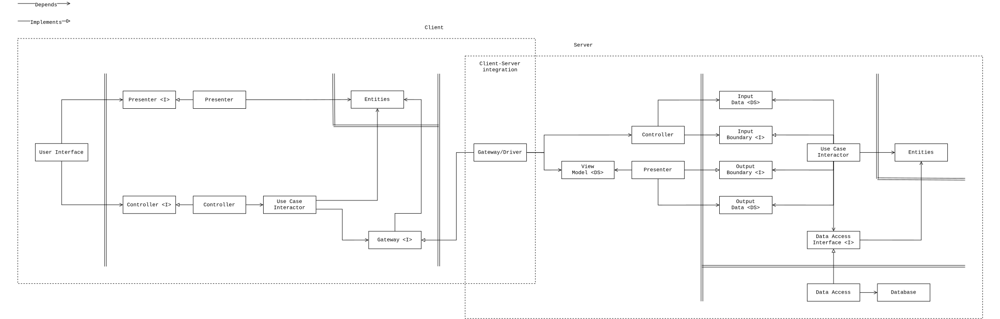
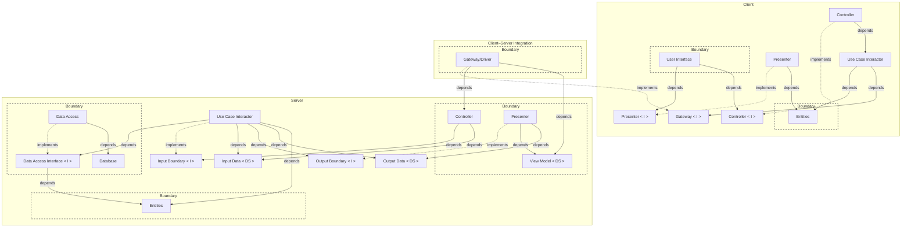
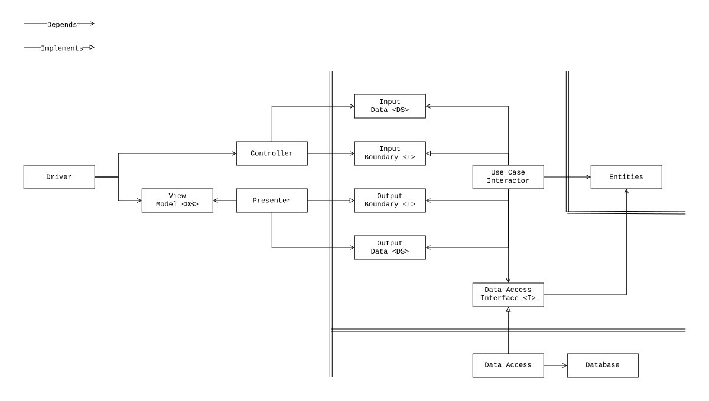
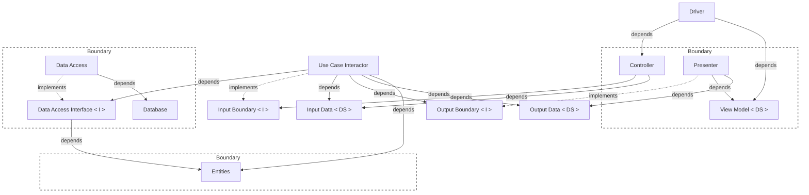
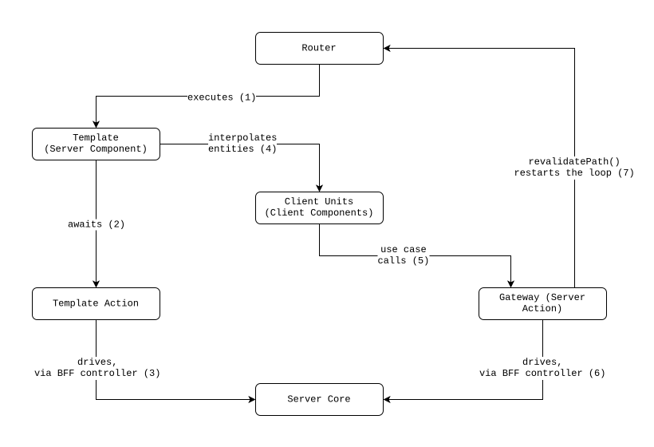
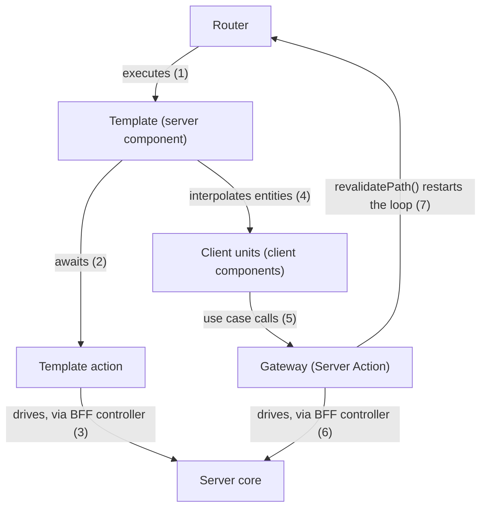

# Clean Architecture — Next.js + React Sample

A full-stack React + Next.js sample application built on the
[Clean Architecture](https://blog.cleancoder.com/uncle-bob/2012/08/13/the-clean-architecture.html)
concept, which covers both the client and the server parts:

- The **client** is a reactive application and follows
  [Clean Reactive Architecture](https://github.com/clean-reactive/documentation/blob/main/docs/architecture.md)
  — the concept's implementation tailored for reactive applications.
- The **server** is the core the client connects to and follows the
  request-response Clean Architecture implementation, where control flows
  through once per invocation and terminates.

The sample shows a concrete, working mapping of every architectural unit from
both diagrams to idiomatic Next.js code — with unit, integration, and end-to-end
tests for each level of composition.

## Getting started

Install dependencies:

```sh
npm ci
```

Start the development server with the in-file backend (JSON files, no database
required):

```sh
npm run dev
```

Or with the SQLite backend (Drizzle + libSQL, local database file):

```sh
npm run db:push       # create the schema on first run
npm run dev:sqlite
```

Default environment values live in `.env`; create a git-ignored `.env.local` to
override them. The `PERSISTENCE` variable selects which backend the DI container
wires up.

Run the tests:

```sh
npm test              # static checks (format, types, lint) + unit tests
npm run test:e2e      # build + Playwright e2e against both backends
npm run test:full     # everything
```

## Tech stack

- [Next.js](https://nextjs.org/) 14 (App Router, Server Actions)
- [React](https://react.dev/) 18
- [TypeScript](https://www.typescriptlang.org/)
- [Zod](https://zod.dev/) for entity models and input validation
- [Drizzle ORM](https://orm.drizzle.team/) +
  [libSQL](https://github.com/tursodatabase/libsql) (SQLite)
- [Lucia](https://lucia-auth.com/) for session-based authentication
- [@evyweb/ioctopus](https://github.com/Evyweb/ioctopus) as the DI container
- [Tailwind CSS](https://tailwindcss.com/) + [shadcn/ui](https://ui.shadcn.com/)
  (Radix UI)
- [Vitest](https://vitest.dev/) for unit and integration tests
- [Playwright](https://playwright.dev/) for end-to-end tests
- [eslint-plugin-boundaries](https://github.com/javierbrea/eslint-plugin-boundaries)
  for architecture boundary enforcement

## Architecture mapping

### Client (Clean Reactive Architecture)

| Architectural unit          | React / Next.js equivalent           | Location                                                                                                         |
| --------------------------- | ------------------------------------ | ---------------------------------------------------------------------------------------------------------------- |
| Enterprise business entity  | Plain data type, server-interpolated | `TodoEntity` in `app/(home)/page.types.ts`                                                                       |
| Application business entity | `useReducer` state machine + context | `app/(home)/reducer.ts` + `context.tsx`, `app/(auth)/*/reducer.ts`                                               |
| Gateway interface           | TypeScript interface                 | `HomePageGateway` in `app/(home)/gateway/gateway.types.ts`, `app/(auth)/*/gateway/gateway.types.ts`              |
| Gateway implementation      | Server Actions bundle                | `app/(home)/gateway/gateway.ts` + `gateway/actions/*.action.ts`                                                  |
| Use case interactor         | React hook                           | `app/(auth)/sign-up/hooks/use-sign-up-use-case.ts`                                                               |
| Presenter                   | React hook returning a view model    | `app/(home)/todos/use-presenter.ts`, `todo-item/use-presenter.ts`, `app/(auth)/sign-up/hooks/use-presenter.ts`   |
| Controller                  | React hook returning callbacks       | `app/(home)/todos/use-controller.ts`, `add-todo/use-controller.ts`, `app/(auth)/sign-up/hooks/use-controller.ts` |
| User interface              | React client components              | `app/(home)/todos/todos.tsx`, `todos/todo-item/todo-item.tsx`, `app/(auth)/sign-in/page.tsx`                     |

Only the sign-up flow has an extracted use case hook: the simpler home-page
controllers still orchestrate their gateway directly, following the
[development methodology](https://github.com/clean-reactive/documentation/blob/main/docs/methodology.md)
— units start inlined and decompose when they grow.

### Server (request-response Clean Architecture)

| Architectural unit                  | Location                                                                                                                                                                  |
| ----------------------------------- | ------------------------------------------------------------------------------------------------------------------------------------------------------------------------- |
| Entities                            | `src/entities/models` (Zod schemas + factories), `src/entities/errors`                                                                                                    |
| Input boundary / Input, Output data | `contract.ts` next to each controller and presenter (`src/interface-adapters/**/contract.ts`)                                                                             |
| Use case interactor                 | `src/application/use-cases/{auth,todos}`                                                                                                                                  |
| Data access interface               | `src/application/repositories/*.interface.ts`, `src/application/services/*.interface.ts`                                                                                  |
| Data access                         | `src/infrastructure/repositories`, `src/infrastructure/services` (`.sqlite` / `.in-file` / `.mock` variants)                                                              |
| Controller / Presenter / View model | `src/interface-adapters/{api,bff,e2e}/**/{controller,presenter}.ts`                                                                                                       |
| Database                            | `drizzle/` (schema + migrations) or JSON files (in-file backend)                                                                                                          |
| Frameworks & drivers                | `app/api/**/route.ts` (REST), `app/**/gateway/actions` (Server Actions), `app/(home)/page.tsx` + `page.action.ts` (template + template action), `tests/e2e/e2e-driver.ts` |

## UML diagram representing fullstack application architecture

The diagram below shows client and server side by side, connected through the
Gateway/Driver seam.



<details>
  <summary>mermaid</summary>



</details>

The diagram below shows the `api` driver exercising the same server core as the
client.



<details>
  <summary>mermaid</summary>



</details>

## Key design decisions

**Page state as a reducer-backed application business entity.** `HomePageEntity`
is a state machine (`view` / `bulk` / `updating`) with events and validity rules
— invalid transitions are simply ignored by the reducer. It persists across use
case calls, is provided through React context, and is the single state both
presenters read and controllers write, keeping the flow unidirectional.

**Pessimistic updates keep enterprise rules server-side.** The client never
mutates enterprise data: every change goes through the gateway, the server
applies the business rules, and a fresh render brings the result back. Rules
live where writes happen — so the client-side enterprise entity is a rule-less
projection, and there is no optimistic-update machinery to reconcile. The
mechanism is described in the
[React server component mental model](#react-server-component-mental-model).

**Server Actions as the client's gateway.** Each page declares its gateway
interface client-side (`gateway.types.ts`); Next.js Server Actions implement it
as a plain pass-through — the `bff` presenters return data already shaped for
the consuming page, so the gateway carries no adaptation logic. The boundary is
crossed as plain data structures — `FormData` in,
`{ status: 'success' | 'failure', code }` out — so the client maps failure codes
to messages without ever seeing server internals. The full role of this unit is
covered in [Gateway/Driver](#gatewaydriver).

**Three drivers over one server core.** The same use cases, entities, and
repository interfaces are driven by three interface-adapter families: `api`
(REST route handlers), `bff` (Server Actions, shaped for specific pages), and
`e2e` (the test driver). Each family has its own controllers and presenters; the
core does not know which driver is calling.

## React server component mental model

Anyone who has written `router → handler (controller) → passive template` in
PHP, Node, or similar will recognize React Server Components as that same flow
with the last two steps swapped.

In the classic flow the router calls a handler — a controller that drives the
server core — and the handler prepares the data and pushes it into a passive
template. Next.js inverts the last two steps —
`router → executable template → handler (controller)`: the router executes a
template (`(home)/page.tsx`), the template awaits its **template action**
(`(home)/page.action.ts`), the action calls the handler — concretely a BFF
controller driving the server core — and the executed template ends up with its
data interpolated. The template pulls its data instead of having it pushed in.

All of this machinery — the router, the template, and its template action — is a
**frameworks & drivers concern**: Next.js machinery that drives the server core
and delivers its output to the client, and none of it is a unit of the client's
Clean Reactive Architecture. The client core (entities, presenters, controllers,
gateway) begins below the template, in the client components it renders.

**Interpolation** is also how enterprise data reaches the client — and why the
client's enterprise business entity is a rule-less projection. Props crossing
into a client component must be plain serializable values, so behaviour cannot
cross: `TodoEntity` values enter the client as interpolated template data and
nothing more. The client never mutates them — every change goes pessimistically
through the gateway, the server core applies the enterprise business rules, and
the Server Action ends with `revalidatePath()` — re-running
`router → executable template → handler (controller)` with fresh data. Rules
live where writes happen — server-side.



<details>
  <summary>mermaid</summary>



</details>

The diagram is drawn at page level because that is where this sample uses it,
but it describes **any server component**: a nested server component may await
its own action and interpolate into its own client units, and the same loop
applies one level down. Only the root is executed by the router — every other
node is executed by its parent, which renders it.

Arrow 7 is the one step that does not recurse: `revalidatePath()` re-enters at
the root and re-runs the whole route, not just the node whose gateway call
triggered it.

A page that needs no server-prepared data skips the split entirely: the sign-in
`page.tsx` is a plain client component — there the page slot is occupied
directly by the user interface unit, with no template or template action.

## Gateway/Driver

On the main diagram, the client–server integration boundary contains a single
unit with two names — **Gateway/Driver** — because the unit belongs to both
architectures at once and plays a different role in each.

**Seen from the client, it is the gateway** — the unit that encapsulates access
to an external resource. Each page declares what it needs from the outside world
as its `gateway<I>` (`HomePageGateway` in `gateway/gateway.types.ts`), and the
client core depends only on that interface: nothing in the entities,
controllers, or use cases knows that the external resource happens to be a
Next.js server.

Note that the standalone Clean Reactive Architecture diagram places an
**External Resource** unit behind the gateway — an opaque stand-in for whatever
sits on the other side. The combined diagram omits that unit deliberately: this
is an integrated full-stack application, so the other side is not opaque — it is
the server, drawn in full right next to the client. The Gateway/Driver connects
directly to the server's controller and view model; an External Resource node
here would only hide the very structure the diagram exists to show.

**Seen from the server, it is a driver** — a unit that exercises the core by
providing input through controllers and consuming their output. The gateway's
Server Actions call BFF controllers and return their view models; the server
core neither knows nor cares that this particular driver is the client's gateway
— the `api` (REST) and `e2e` (test) drivers exercise the same core through their
own controller and presenter families.

Two names on one unit may look like two responsibilities, but it is one:
carrying a call across the client–server boundary. "Gateway" and "driver" are
the names the two architectures give to that same job — each core sees exactly
one role, and the duality exists only at the integration boundary, where the
unit is the seam. The single responsibility holds because the unit does nothing
but cross the boundary — which the next rule keeps true.

**The Gateway/Driver prepares no data.** The unit is a bundle of Server Actions
(`gateway/gateway.ts` assembles them into the `HomePageGateway` implementation),
and each action does boundary work only: `toggle-todo.action.ts` reads the
session cookie, calls the injected BFF controller, and returns the BFF view
model as-is. Preparing input data is the BFF controller's job; shaping the
response is the BFF presenter's job — every adaptation lives in the server's
interface adapters, and every driver stays thin.

<details>
  <summary><b>Why a Server Action?</b></summary>

It is the framework's native form for exactly this seam: a typed function the
client calls and the framework transports — no hand-written route handler, no
fetch client, no serialization code. Next.js also requires Server Action
arguments and results to be plain serializable values, so the boundary rule —
data crosses as data structures — is enforced mechanically rather than by
convention. And a Server Action runs in frameworks & drivers, outside both
cores, which is why the unit may read `cookies()` and finish with
`revalidatePath()` — touching the router is framework territory, legal in the
outermost ring — closing the pessimistic update loop described in the React
server component mental model.

</details>

## Folder structure

Clean Architecture concept does not define a file or folder structure — it
describes units and their dependencies. Organizing them into files is a separate
organizational decision, taken per project.

**The client is vertical-sliced.** Each route folder owns its own units — its
application business entity, its gateway, and its user interface with the
presenters and controllers those components need.

**The server is layered.** `src` is grouped by the layers of the concept's
circle diagram — _enterprise business rules_ (`entities`), _application business
rules_ (`application`), _interface adapters_ (`interface-adapters` for
controllers and presenters, `infrastructure` for the gateways behind them). The
outermost ring, _frameworks & drivers_, has no folder in `src` — it is `app`
itself (Server Actions, API handlers), `drizzle` (schema + migrations), and
`tests/e2e`, with `di` wiring them to the core.

```console
app                              # the client (Clean Reactive Architecture)
├── (auth)
│   ├── sign-in
│   │   ├── gateway              # gateway <I> + server-action implementation
│   │   ├── page.tsx
│   │   └── reducer.ts           # application business entity
│   └── sign-up
│       ├── gateway
│       ├── hooks                # controller, presenter, use case
│       ├── page.tsx
│       └── reducer.ts
├── (home)
│   ├── add-todo                 # user interface + controller
│   ├── gateway                  # gateway <I> + server-action implementation
│   │   └── actions
│   ├── todos                    # user interface + presenter + controller
│   │   └── todo-item
│   ├── context.tsx              # entity provider
│   ├── page.action.ts           # template action (frameworks & drivers)
│   ├── page.tsx                 # template (frameworks & drivers)
│   └── reducer.ts               # application business entity
├── api                          # REST driver (route handlers)
└── _components                  # shared UI kit (shadcn/ui)

src                              # the server core (request-response Clean Architecture)
├── entities                     # enterprise business rules layer
│   ├── models                   # enterprise business entities (Zod) + factories
│   └── errors
├── application                  # application business rules layer
│   ├── use-cases                # use case interactors
│   ├── repositories             # data access interfaces
│   └── services                 # service interfaces
├── infrastructure               # interface adapters layer (data access implementations)
│   ├── repositories             # *.sqlite / *.in-file / *.mock
│   └── services
└── interface-adapters           # interface adapters layer (controllers/presenters)
    ├── api                      # controllers/presenters for the REST driver
    ├── bff                      # controllers/presenters for the server-action driver
    └── e2e                      # controllers/presenters for the e2e test driver

di                               # ioctopus DI container + modules
drizzle                          # database schema + migrations
tests
├── unit
├── integration
└── e2e                          # Playwright, runs against both backends
```

## Further reading

- [Clean Reactive Architecture](https://github.com/clean-reactive/documentation/blob/main/docs/architecture.md)
- [Development Methodology](https://github.com/clean-reactive/documentation/blob/main/docs/methodology.md)

## Credits

This sample is based on
[nikolovlazar/nextjs-clean-architecture](https://github.com/nikolovlazar/nextjs-clean-architecture)
at commit
[`bdfaf312`](https://github.com/nikolovlazar/nextjs-clean-architecture/tree/bdfaf312ed47ce8dce6647009eabcb2f1b6150d3).
