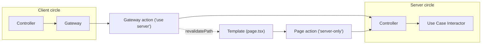

# Server actions

The home page is the reference for how server-side work is organised in this
application. Everything here is Next.js specific - it is the shape the
architecture takes once the framework fuses roles the diagram keeps apart.

## The template and its interpolation

`page.tsx` is a template, executed on the server. Next.js fuses two roles into
that one function: the **request handler**, which acquires the data, and the
**view**, which renders it. Classic stacks keep them in separate files - an
Express route calls `res.render(view, data)`, a Razor Page pairs `Index.cshtml`
with `Index.cshtml.cs`. Here they are one function, so the handler half is kept
in its own module and the template only calls it:

```tsx
export default async function HomePage() {
  const { todos } = await homePageAction();
  return <HomePageProvider>{/* ... */}</HomePageProvider>;
}
```

The `await` is the handler. The JSX is the view. Keeping `page.action.ts`
separate is what stops the seam from disappearing.

Interpolation is not a one-time seed. A classic template interpolates once and
the client owns the data afterwards; here the template re-interpolates every
time a gateway action calls `revalidatePath('/')`. The client never takes
ownership of what it receives.

## Two kinds of action

Every server-side unit that drives the core is an **action**. Actions are
discriminated by exposure, not by whether they read or write:

|            | Gateway action                   | Page / widget action              |
| ---------- | -------------------------------- | --------------------------------- |
| Marker     | `'use server'`                   | `import 'server-only'`            |
| Exposure   | public RPC endpoint              | none                              |
| Invoked by | the client, through `Gateway<I>` | the template                      |
| Role       | external resource                | driver                            |
| Lives in   | `actions/*.action.ts`            | beside its unit, `page.action.ts` |
| Contract   | `gateway.types.ts`               | `page.types.ts`                   |

Exposure is the axis that matters because it is the security axis and the
architectural axis at once. A `'use server'` function is reachable by anyone who
can replay its action id, so it needs the same authorisation as a route handler
even though the call site reads like a local function call.

Gateway actions are grouped in `actions/` because they share one contract -
`HomePageGateway` aggregates all of them. Page and widget actions have exactly
one consumer each, so they sit beside the unit they prepare.

Contracts are named after their **consumer**: `page.types.ts` belongs to
`page.tsx`, `todos.types.ts` belongs to `todos.tsx`. `gateway.types.ts` is the
exception only because its consumers are scattered across the feature with no
single home.

## Responsibilities

A **page action** prepares the template for the user. It may interpolate values,
guard, redirect, or any combination - `homePageAction` does all three. Selecting
a response rather than rendering one is its job, not a leak: it is what
`IActionResult` names in ASP.NET Core and what `res.redirect` names in Express.
A page action that only guards resolves with `void`.

A **gateway action** satisfies the client's gateway contract. It adapts the
ambient request into controller input, drives the core, and declares its
invalidation - `revalidatePath`, a `redirect`, or explicitly none.

Neither kind declares a port for the controller it drives. The type flows out of
`getInjection` and meets the action's own declared contract structurally. That
single point is the only place the two contracts are checked against each other.

## Two entities in parallel

The feature holds two entities, one from each category the architecture docs
define:

- `HomePageEntity` (`reducer.ts`) is an **application business entity** -
  bulk-edit interaction state, client-owned, with its own transitions and
  validity rules.
- `TodoEntity` (`page.types.ts`) is an **enterprise business entity** -
  server-owned, supplied by the page action, read-only on this side.

They live side by side in separate modules rather than in one: only one of them
has transitions, and only one of them is what the page action produces.
Presenters depend on both, which is the diagram's `presenter -> entities` edge
with the entities layer holding a mix of the two categories - exactly what the
definition allows.

## Where the two circles collide

A gateway action is two things at once: the frontend's `Gateway<I>`
implementation and the backend's inbound driver. The `'use server'` line is the
boundary, and it runs through the middle of the function - the type annotation
belongs to the client, the body belongs to the server.

<details>
  <summary>mermaid</summary>



</details>

This is why the failure-code taxonomy is declared on both sides. Each circle
owns the contracts its own consumers need; neither may import the other's.
`TodoEntity` in `page.types.ts` and `Todo` in `src/entities/models/todo.ts` are
deliberately separate declarations of the same concept, and they meet
structurally inside the action.

> NOTE: importing `src/entities/**` into `app/**` is the tempting DRY move and
> the one thing this arrangement exists to prevent.

## Rules

1. One page/widget action per request per route. Nothing structural enforces it
   today - the moment a widget action joins the page action, both must be
   memoized with React `cache()` or the route resolves the core twice, with two
   possibly inconsistent snapshots in one render.
2. Every gateway action authorises. It is a public endpoint.
3. Every gateway action declares its invalidation, including "none".
4. Actions declare no controller ports.
5. No imports across the circles.

> NOTE: rule 1 is not a new hazard. ASP.NET MVC child actions allowed any view
> to re-enter the request pipeline and became notorious for per-view database
> hits; ASP.NET Core removed them in favour of injected, memoized View
> Components. RSC reintroduces the same door.

## Prior art

The pair of roles here is old, and every stack names it differently.

- Express + EJS: `app.get()` handler and `res.render(view, data)`
- ASP.NET Core: `PageModel.OnGetAsync()` and `Index.cshtml`
- ASP.NET MVC: controller action returning `View(model)` - the origin of
  "ViewModel" in the sense the architecture docs use it
- Laravel: `View Composer`, a class bound to a view whose only job is supplying
  its data
- Smarty / Twig: `assign()` and `render(template, context)`

See also:

Next.js [Data Security](https://nextjs.org/docs/app/guides/data-security) - the
Data Access Layer, `server-only`, and returning minimal data structures.

Next.js
[How to Think About Security in Next.js](https://nextjs.org/blog/security-nextjs-server-components-actions)
